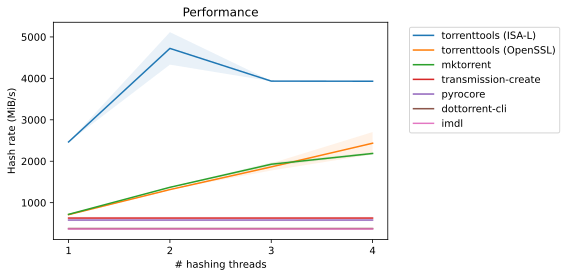

[](https://copr.fedorainfracloud.org/coprs/fbdtemme/torrenttools/package/torrenttools/)
[](https://github.com/fbdtemme/torrenttools/releases)
[](https://isocpp.org/)
[](https://app.codacy.com/manual/floriandetemmerman/torrenttools?utm_source=github.com&utm_medium=referral&utm_content=fbdtemme/bencode&utm_campaign=Badge_Grade_Dashboard)
[](https://opensource.org/licenses/MIT)

A commandline tool for creating, inspecting and modifying bittorrent metafiles.

[**Features**](#Status) |
[**Documentation**](#Documentation) |
[**Packages**](#Packages) |
[**Building**](#Building) |
[**License**](#License)

## Features

* Creating bittorrent metafiles. 
* Inspecting bittorrent metafiles.
* Verifying bittorrent metafiles against local data.
* Editing existing bittorrent metafiles.
* Support for the new [v2 and hybrid protocols](https://blog.libtorrent.org/2020/09/bittorrent-v2/) .
* Support for tracker abbreviations.
* Support for announce substitution parameters. 
* Fast multi-buffer hashing with Intel ISA-L.

## Example


## Status

This project is under development. 
The commandline interface can change at any release prior to 1.0.0.

## Performance

Following test were performed on a in in-memory filesystem with 1 MiB piece size 
and as target a file filed with random data totalling 15.0 GiB:
The tested CPU is an Intel i7-7700HQ in a Dell XPS 15-9560 machine.



## Documentation

Documentation is hosted on [Github Pages](https://fbdtemme.github.io/torrenttools/).


## Packages

### Fedora

Binary and source packages for Fedora 32, Fedora 33, Fedora 34 and Fedora Rawhide and CentOS
stream are available in a [COPR repo](https://copr.fedorainfracloud.org/coprs/fbdtemme/torrenttools/).

```shell
sudo dnf copr enable fbdtemme/torrenttools
sudo dnf install torrenttools
```

### CentOS/RHEL

Binary and source packages for CentOS8/RHEL8 and CentOS stream are available
in a [COPR repo](https://copr.fedorainfracloud.org/coprs/fbdtemme/torrenttools/).

```shell
sudo dnf copr enable fbdtemme/torrenttools
sudo dnf install torrenttools
```
### Ubuntu

Binary and source packages for Ubuntu 20.04, Ubuntu 20.10, Ubuntu 21.04 are available
as a PPA via [launchpad](https://launchpad.net/torrenttools).

```shell
sudo add-apt-repository ppa:fbdtemme/torrenttools
sudo apt-get update
sudo apt install torrenttools
```
### Debian 

A binary package is available for Debian Sid.
Older debian distributions should use the AppImage.

```shell
echo 'deb http://download.opensuse.org/repositories/home:/fbdtemme/Debian_Unstable/ /' | sudo tee /etc/apt/sources.list.d/home:fbdtemme.list
curl -fsSL https://download.opensuse.org/repositories/home:fbdtemme/Debian_Unstable/Release.key | gpg --dearmor | sudo tee /etc/apt/trusted.gpg.d/home_fbdtemme.gpg > /dev/null
sudo apt update
sudo apt install torrenttools
```

### openSUSE

For openSUSE Tumbleweed run the following as root:

```shell
zypper addrepo https://download.opensuse.org/repositories/home:fbdtemme/openSUSE_Tumbleweed/home:fbdtemme.repo
zypper refresh
zypper install torrenttools
```
For openSUSE Leap 15.2 run the following as root:
```shell
zypper addrepo https://download.opensuse.org/repositories/home:fbdtemme/openSUSE_Leap_15.2/home:fbdtemme.repo
zypper refresh
zypper install torrenttools
```
For openSUSE Leap 15.3 run the following as root:
```shell
zypper addrepo https://download.opensuse.org/repositories/home:fbdtemme/openSUSE_Leap_15.3/home:fbdtemme.repo
zypper refresh
zypper install torrenttools
```

### SUSE Linux Enterprise Server 15
For SLE 15 SP2 run the following as root:
```shell
zypper addrepo https://download.opensuse.org/repositories/home:fbdtemme/SLE_15_SP2/home:fbdtemme.repo
zypper refresh
zypper install torrenttools
```
For SLE 15 SP3 run the following as root:
```shell
zypper addrepo https://download.opensuse.org/repositories/home:fbdtemme/SLE_15_SP3/home:fbdtemme.repo
zypper refresh
zypper install torrenttools
```


### Arch

A source package for Arch linux is available on [AUR](https://aur.archlinux.org/packages/torrenttools/).

```shell
git clone https://aur.archlinux.org/torrenttools.git
cd torrenttools
makepkg -is
```

### Docker

A docker image is available on [dockerhub](https://hub.docker.com/repository/docker/fbdtemme/torrenttools).

```shell
docker pull fbdtemme/torrenttools
```

### AppImage

An AppImage is available for download as a [release asset](https://github.com/fbdtemme/torrenttools/releases).

## Building

This library depends on following projects:

*  [CLI11](https://github.com/CLIUtils/CLI11)
*  [Catch2](https://github.com/catchorg/Catch2)
*  [CTRE](https://github.com/hanickadot/compile-time-regular-expressions)
*  [gsl-lite](https://github.com/gsl-lite/gsl-lite)
*  [RE2](https://github.com/google/re2)
*  [expected-lite](https://github.com/martinmoene/expected-lite)
*  [fmt](https://github.com/fmtlib/fmt)
*  [nlohmann/json](https://github.com/nlohmann/json)
*  [yaml-cpp](https://github.com/jbeder/yaml-cpp)
*  [bencode](https://github.com/fbdtemme/bencode)
*  [date](https://github.com/HowardHinnant/date)
*  [OpenSSL](https://github.com/openssl/openssl) 
*  Optional: [ISA-L Crypto](https://github.com/intel/isa-l_crypto)

Almost all dependencies can be fetched from github during configure time or can be installed manually.
OpenSSL has to be installed on the system in advance.

### Installing build dependencies

Ubuntu

```shell
sudo apt install build-essential git cmake g++-10 libssl-dev 
```

Fedora/RHEL/CentOS

```shell
sudo dnf install cmake make g++ git openssl-devel automake autoconf
```

### Configuration

| Option                         |  Type    |  Description                 |
|--------------------------------|----------|------------------------------| 
| TORRENTTOOLS_BUILD_TESTS       | Bool     | Build tests.                 |
| TORRENTTOOLS_BUILD_DOCS        | Bool     | Build documentation.         |
| TORRENTTOOLS_INSTALL           | Bool     | Generate an install target.  |
| DOTTORRENT_MB_CRYPTO_LIB       | String   | Pass "isal" for fast multibuffer hashing |

### Building

This project requires C++20.
Currently only GCC 10 or later is supported.

This project can be build as every other project which makes use of the CMake build system.

```{bash}
mkdir build
cd build
cmake -DCMAKE_BUILD_TYPE=Release ..
cmake --build . --target torrenttools
```

### Installation

Installing the project:

```{bash}
sudo cmake --install . --component torrentttools
```

## License

Distributed under the MIT license. See `LICENSE` for more information.
