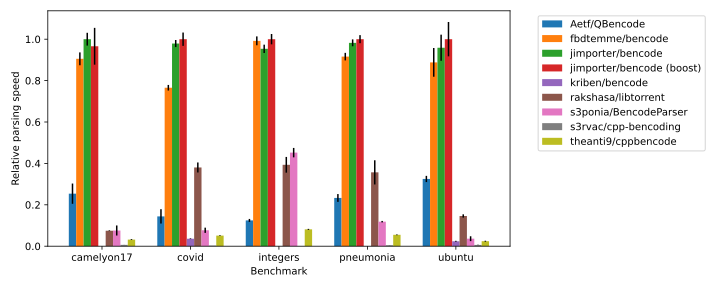
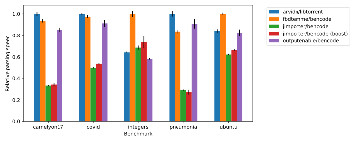

Performance
===========

The decoding performance was benchmarked against following libraries:

* `arvidn/libtorrent <https://github.com/arvidn/libtorrent>`_
* `jimporter/bencode <https://github.com/jimporter/bencode.hpp>`_
* `s3rvac/cpp-bencoding <https://github.com/s3rvac/cpp-bencoding>`_

Benchmarks
----------

* integers:
    A list of integer values with a uniform distribution over the full 64-bit signed integer range.
* pneumonia:
    A bittorrent file with 29686 jpeg images of the kaggle RSNA Pneumonia Detection Challenge.
    The jpeg images are around 100 KiB each.
* camelyon17:
    A bittorrent file with data of the CAMELYON17 challenge.
    It contains 1156 xml files and images. The images are a few GiB large.
* covid:
    A bittorrent file of COVID-19 related images with 20 files of around 100 MiB.
* ubuntu:
    A small bittorent file of the ubuntu 20.04 LTS server distribution.

Results
-------

Value
*****

libtorrent is not included since it does not have a bencode parser which decodes to a
owning data representation.

View
*****

Note that libtorrent does not actually decode integers when parsing, but defers to when
the value is accessed. All other projects do parse the integers directly when decoding.
s3rvac/cpp-bencoding does not have a view type.

The more extensive view model of libtorrent and fbdtemme/bencode clearly provides a large
performance benefit for in-situ parsing by requiring less dynamic-memory allocations.
Parsing large integer values such as those in the "integers" benchmark is significantly
faster in fbdtemme/bencode due to SWAR optimisations.