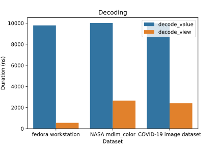

.. cpp:namespace:: bencode

Value and view types
====================

This library contains two types to represent bencoded data,
the value type :cpp:class:`bvalue` and the view type :cpp:class:`bview`.

:cpp:class:`bvalue` owns the data it contains.
Parsing to :cpp:class:`bvalue` involves copying data to the internal storage of a :cpp:class:`bvalue`.
:cpp:class:`bvalue` can modify the stored values.

:cpp:class:`bview` does not own any data.
Parsing to :cpp:class:`bview` is done by creating an index of type :cpp:class:`descriptor_table`
into a stable buffer with bencoded data.
Based on this index :cpp:class:`bview` provides read-only access to the bencoded data.

The interfaces of :cpp:class:`bvalue` and :cpp:class:`bview` are very similar.
This enable the use of both types in a generic code.

Performance
-----------

Parsing to :cpp:class:`bview` is about 5 times faster then parsing to :cpp:class:`bvalue`.

Contents
--------

:ref:`bvalue`
:ref:`bview`

